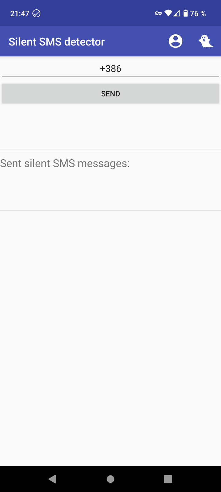

# 静默短信检测器

Android 应用程序，用于检测（和发送）*Class-0* 无声 SMS 消息（二进制消息），无需 root 设备。

## 什么是无声短信？

无声 SMS（*短信服务*）是一种在手机用户不知情或未同意的情况下发送到手机的文本消息。 与常规 SMS 消息不同，静默 SMS 消息是不可见的，不会在目标手机上触发任何通知或声音。

此功能并不是某种秘密黑客攻击，而是实际上是两个移动电信标准的一部分，即 [3GPP 23.040（最初是 GSM 03.40）](https://en.wikipedia.org/wiki/GSM_03.40) 和 [3GPP 23.038 （最初是 GSM 03.38）]（https://en.wikipedia.org/wiki/GSM_03.38）。

通过向目标手机发送静默短信，发送者可以检测手机是否在线或离线。 或者更具体地说 - **发送者可以检测目标 SIM 卡是否连接到网络**。 这使得攻击者能够确定特定的手机号码是否处于活动状态。

然而，无声短信**也可用于确定目标移动设备**的位置。 当静默短信发送到目标设备时，它会强制目标设备透露其位置，因为它会连接到蜂窝网络中最近的（可用）服务基站。 在这种情况下，执法机构可以使用静默短信来进行监视和跟踪，因为它们可以让他们在不提醒用户的情况下定位手机的位置。 据了解，过去，[德国警方一直使用静默短信来追踪嫌疑人](https://edri.org/our-work/edrigramnumber10-2silent-sms-tracking-suspects/)。

### 短信类型

SMS 消息有多种类型。 SMS 标准定义了许多“二进制 SMS 消息”，这些消息通常发送到 SIM 卡而不是用户。 其中每一条都可以被视为无声短信。 然而，我们的应用程序*无声短信检测器*只能检测其中的某些类型 - *Class 0*短信。

- **Class 0 SMS**
  该消息立即显示在手机上，并将消息发送报告发送回发件人。 该消息不必保存在移动电话或 SIM 卡中（除非移动用户选择这样做）。 这种类型也称为*Flash SMS*。 此 SMS 类型的某些参数（标志）会导致消息不显示在手机上（并且不保存在手机上），但发件人仍会收到收据。 在这种情况下，*Class-0* 消息将用作静默 SMS 消息。 *静默短信检测器*应用程序只能检测**这些（二进制）消息**。

- **Class 1 SMS**
  这是一条普通的短信。 此消息存储在移动电话或 SIM 卡的内存中（取决于内存可用性）。

- **Class 2 SMS**
  此类消息携带SIM卡数据。 在向发送者（通常是运营商）发送确认之前，必须成功传输 SIM 卡数据。 如果无法进行此传输，则会向发送方发送一条错误消息。 通常它用于将一些技术数据从移动运营商发送到SIM卡。 收到回执即表示数据已成功传输至SIM卡。

- **Class 3 SMS**
  这些是从接收实体转发到外部设备的普通 SMS 消息。 无论消息是否转发到外部设备，传送确认都会发送给发送者。

- **Type 0 SMS**
  这些是真正的无声短信，不会在手机上显示任何通知，但会向发件人返回送达收据。 这些消息中的“TP_PID”字段设置为值“0x40”。 该消息的目的只有一个——跟踪用户。 应用程序*静默短信检测器* **无法检测这些消息**。

2010 年 5 月，Google [对 Android 代码进行了更改](https://android-review.googlesource.com/c/platform/frameworks/base/+/14069)，以完全隐藏 Type-0 SMS 消息。 这意味着这些消息不会出现在任何地方，不会保存在手机上，也不向收件人显示任何通知。 理论上，可以通过更改 Android 代码来检测这些消息，但这可能意味着您的 Android 设备不符合移动标准。 然而，[研究表明](https://akaki.io/2022/transmission_and_detection_of_silent_sms_in_android)接收Type-0消息会触发Android日志中的一条记录(`GsmInboundSmsHandler: 已接收短消息类型0，不显示或存储。发送 确认。`）。 不幸的是，这需要 root 的 Android 设备。 如前所述，应用程序“无声短信检测器”无法检测到这些消息。

## 这个应用程序在做什么（以及*不做什么*）？

此应用程序是 [Android Silent SMS Ping](https://github.com/itds-consulting/android-silent-ping-sms) 的一个分支，可以发送静默 SMS 消息来确定目标 SIM 卡（手机）是否 号）是否处于活动状态。 它还可以检测收到的静默短信并提醒用户他收到了静默短信。 但是，它仅处理*Class 0* SME 消息，而不处理*Type 0* SMS 消息。

该应用程序在新的 Android 设备上运行，不需要 root 设备。

重要的是要了解，接收静默短信**并不一定意味着您已成为某些恶意行为者的目标**。 无声短信[可能因各种技术原因而被使用](https://nickvsnetworking.com/gsm-with-osmocom-silent-sms-silent-calls/)并且接收无声短信并不是成为攻击目标的良好指标 您的手机运营商、政府或黑客。 这些消息还可用于发送二进制内容，例如铃声、徽标或 WAP 推送消息以及无线 (OTA) 编程或配置数据。 例如，静默 SMS 消息可以发送到您的 SIM 卡以用于**漫游目的**。 大多数 SIM 卡上都有定义首选网络的字段。 运营商控制的 PLMN 列表（公共陆地移动网络），即所谓的 OPLMN，通常由归属网络运营商通过空中传输 (OTA) 进行更新。 每当您进入一个新国家/地区时，通常都会发生这种情况。 在这种情况下，二进制短信将发送到您的手机，*无声短信检测器*将检测该短信。 然而，这并不意味着您正在被跟踪或发生了一些不好的事情。

另一方面，移动用户跟踪还有其他几种可能性，因此**您没有收到静默短信的事实并不意味着您没有被跟踪**。 如果你想避免被跟踪，你应该打开飞行模式（或者关闭手机），但这当然会严重降低用户体验，所以不太实用。

哦，顺便说一句，您知道您的 SIM 卡可以在您不知情的情况下发送短信吗？ 2021 年，David Allen Burgess 发现 SIM 卡可以从您的手机发送数据[您或您手机的操作系统不知情](https://www.youtube.com/watch?v=0Em-J_3QYu4)。 没有关于这些消息的公开文档，您看不到它们，移动运营商也不会谈论它们。 在调查的案例中，[Burgess发现](https://medium.com/telecom-expert/what-is-at-t-doing-at-1111340002-c418876c212c)SIM卡一直在发送不同的数据，包括IMEI 当前手机的号码以及插入SIM卡的**之前手机**的IMEI号码！ 因此，有一些用户通常不知道的“幕后”发生的事情。

**无论如何，您收到静默短信的通知并不一定意味着发生了不好的事情，并且没有此通知并不意味着您不会受到跟踪。**

但是，如果您想对“幕后”发生的事情有更大的透明度，*静默短信检测器*可能是一个有趣的应用程序。 因为静默短信是对您隐藏的，并且通过此应用程序您可以检测到其中的一些短信。 *这不是很酷吗？*

### history

最初的应用程序名为 [Android Silent SMS Ping](https://github.com/itds-consulting/android-silent-ping-sms) 于 2016 年首次开发。不幸的是，它已经好几年没有维护了，并且 原作者于 2020 年将其存档于 Github 存储库。

到 2023 年，应用程序仍然可以通过 F-Droid 访问，但 Virustotal 分析显示 APK 已被感染。

2023年初，我们开始了新的发展。 在第一阶段，我们更新了 SDK（至版本 33）和 Java（至版本 11）。 我们设置了与现代 Android 系统兼容的应用程序权限并改进了通知。 我们还设计了新的应用程序图标。

目前应用程序已经完全运行（您可以从下面的 APK 安装它或自己使用 Android Studio 编译它），但它看起来仍然像旧的那样。

因此，在第二阶段，我们计划实施应用程序的新设计。 稍后将添加一些新功能。 具体来说，我们希望实现威胁分析的数据收集，以便收集有关静默短信的数据并获取一些可以帮助我们估计问题范围的数据。 请继续关注并检查问题！

### license

该项目根据 [GNU 通用公共许可证版本 3（或更高版本）](https://github.com/MatejKovacic/silent-sms-ping/blob/master/LICENSE) 获得许可。

### APK下载（用于测试）

由于此应用程序正在大力开发中，因此您尚无法从 Play 商店安装此应用程序。

但您可以下载[从 22-04-2023 开始测试 APK](https://github.com/MatejKovacic/silent-sms-ping/blob/master/silent-sms-app-debug_22-04-2023.apk) 并 将其安装在您的设备上。 点击下载按钮将其下载到您的设备上，然后您可以直接安装APK。 请注意，在这种情况下，您应该允许在您的 Android 设备上安装未知应用程序，因为 APK 未经过数字签名。

您还可以检查“silent-sms-app-debug_22-04-2023.apk”文件的哈希值：
- SHA512：`8293e381d6033a5c2cd152bd8e2cd3543fc856e84653c631bb0497b55a9f85759e7b63aa70ef81c27caad6f66c2e87e7c966f92af6a56113fd28fa7e12 f6e674`
- SHA256：`7a766747eade07251faccc7e53a75d13290eb187d721da74638c561316c16b8c`
- MD5：`77d3492d893c0a38dc3b41ed09e174d8`

但你已经被警告过。 :)

另一种选择是在您的计算机上克隆此存储库，安装 *Android Studio*，自行编译应用程序，然后将其直接安装到您的 Android 设备上。

另请注意，您的手机上需要安装有故障的新 Android。

当然，我们始终欢迎您检查应用程序的源代码，以检查它是否不包含某些恶意代码。 您还可以为该项目贡献您的代码或想法。

